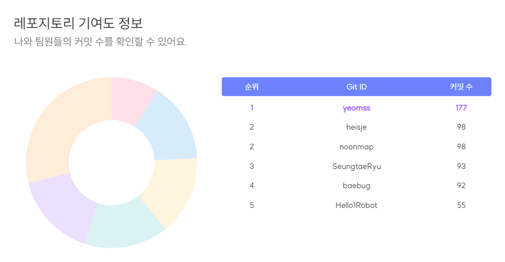
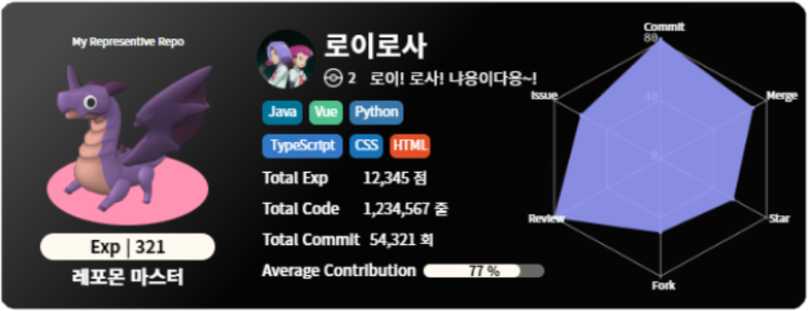
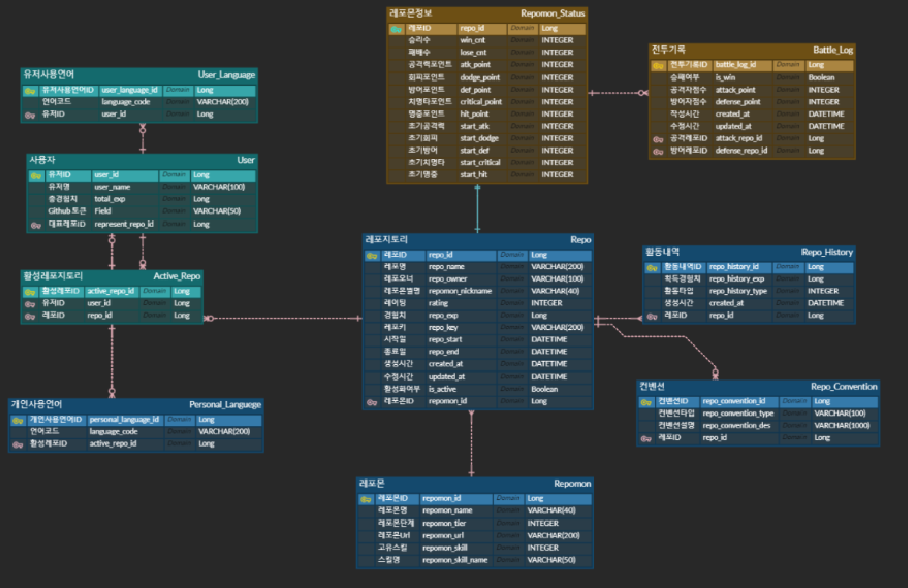

# 🐱‍👤 RepoMon 🐱‍👤

SSAFY 8기 2학기 자율프로젝트

2023.04.10 ~ 2023.05.19

## ☁ 목차

1. [서비스 소개](#-서비스-소개)
2. [소개 영상](#-소개-영상)
3. [주요 기능](#-주요-기능)
4. [기능 명세서](#-기능-명세서)
5. [API 명세서](#-api-명세서)
6. [ERD](#-erd)
7. [프로젝트 구조](#-프로젝트-구조)
8. [아키텍처 구조](#-아키텍처-구조)
9. [팀원 소개](#-팀원-소개)

## 🐀 서비스 소개

Github의 사용자는 나날이 증가하는 가운데, 프로젝트의 지표를 설명할 도구들은 마땅치 않은 상황입니다.

"레포몬"은 이러한 프로젝트의 정보를 분석 및 요약하여 레포지토리를 대표하는 캐릭터와 함께 한 장의 카드로 만들어 나타낼 수 있게 하는 서비스입니다.

먼저 **레포지토리 분석 기능**에서는 레포지토리의 정보를 가져와 커밋, 머지, 이슈, 리뷰, 포크, 스타를 점수화 시켜 총 경험치를 나타내줍니다. 또한 컨벤션을 등록하여 준수율을 확인하고, 각 커밋의 기여도를 유저 별로 나타낼 수 있습니다.

다음으로 **정보 카드 생성**입니다. 사용자의 정보를 요약한 유저 카드, 레포지토리의 정보를 요약한 레포 카드, 해당 레포지토리에서 본인의 기여도 및 언어를 선택하여 제작할 수 있는 퍼스널 레포 카드 세 가지를 생성할 수 있습니다.

마지막으로 **레포몬 배틀**입니다. 앞서 획득했던 경험치를 토대로 레포몬을 진화 및 성장시킬 수 있으며, 나만의 레포몬과 다른 사람의 레포몬을 배틀을 통해 경쟁시킬 수 있습니다.

이러한 기능을 통해 프로젝트를 활성화하고, 레포지토리의 분석 결과를 리드미에 작성해보세요 ✨

## 🐂 소개 영상

### [구글 드라이브 링크](https://drive.google.com/file/d/17gf3iummO-fu-awmFWhAsgmPPZxklRNe/view?usp=share_link)

## 🐅 주요 기능

1. **메인 페이지**

- 레포몬과의 상호작용을 통해 Git 사용법 툴팁 출력
- 캐러셀을 통해 서비스에 대한 간단한 설명 제시

2. **레포지토리 조회**

- 각 사용자의 레포지토리 정보 조회
- 각 레포지토리의 정보는 Redis에 저장하여 이후 조회 시간을 줄임

3. **레포몬 생성**

- 세 가지의 랜덤 레포몬 제시 및 선택
- 닉네임 중복 확인 및 설정
- 초기 컨벤션 등록
- 주사위를 통한 랜덤 능력치 선택 기능
- 레포몬은 ThreeJS를 사용하여 구현

4. **레포지토리 세부 조회 및 기간 설정**
    
    
    
- 레포지토리를 선택하여 상세 레포지토리 정보 확인 가능
- 선택한 레포몬과 경험치에 따른 현재 레벨 출력
- 기간 설정 버튼으로 프로젝트의 시작일과 종료일 설정 가능
- 성장, 컨벤션, 기여도, 배틀 탭으로 이동 가능

5. **레포지토리 분석 및 경험치 산출**

- 6가지 지표(커밋, 머지, 이슈, 리뷰, 포크, 스타)를 통해 각 레포지토리 분석 및 경험치 산출
- 일자별 성장 그래프와 누적 성장 그래프 확인 가능
- 등록된 전체 레포지토리를 대상으로 각 레포의 경험치 순위 반환
- 해당 지표는 Chart.js를 사용

6. 레포지토리 컨벤션 분석
    
    
    

- 등록한 컨벤션을 기준으로 각 커밋의 준수율 확인 가능
- 어떤 컨벤션을 얼마나 준수했는지를 차트를 통하여 나타냄
- 해당 지표는 Chart.js를 사용

7. 각 레포별 기여도 확인
    
    
    

- 해당 레포지토리의 커밋 내역을 확인하여 기여자의 순위를 나타냄
- 해당 지표는 Chart.js를 사용

8. 정보 카드 생성

- 분석된 레포지토리의 정보를 토대로 정보 카드 생성
- 레포지토리의 정보를 요약한 레포지토리 카드 생성 가능
- 레포지토리의 본인의 기여도와 사용 언어를 설정한 퍼스널 레포지토리 카드 생성 가능
- 사용자의 전체 레포 정보를 종합한 유저 카드 생성 가능
- Django를 통해 SVG 형태로 카드 생성
- Redis에 카드 정보를 저장하여 이후의 조회 시간 단축

9. 레포몬 스탯

- 레포지토리 분석 결과 획득한 경험치 100포인트 당 능력치 포인트 1 제공
- 포인트를 통해 공격, 방어, 치명타, 회피, 명중 스테이터스 설정

10. 레포몬 배틀
    
    
    
- 각 레포몬의 레이팅에 따라 레포몬 매칭
- 선∙후공 랜덤 설정
- 레포몬의 스테이터스 및 난수에 따른 데미지 설정
- 공격 측의 공격∙치명타∙스킬 및 방어측의 피격∙회피 모션
- 레이팅 및 스테이터스에 따라 획득하거나 손실되는 레이팅 변화

11. 랭킹
    
    
    
- 각 레포지토리의 경험치에 따른 레포 순위 반환
- 각 레포몬의 레이팅에 따른 배틀 순위 반환
- 각 유저의 총 레포지토리 경험치에 따른 유저 순위 반환

12. 크롬 익스텐션

- 마이페이지에서 발급받은 Key를 통해 크롬 익스텐션 사용 가능
- 레포몬 배틀 기능 스크립트 형식으로 지원

## 🐇 기능 명세서

## 🐉 API 명세서

## 🐍 ERD

## 🐎 프로젝트 구조

<h4>Back_디렉토리 구조</h4>

</img>

<h4>Front_디렉토리 구조</h4>

</img>

<h4>Extension_디렉토리 구조</h4>

</img>

<h4>Django_디렉토리 구조</h4>

</img>

## 🐑 아키텍처 구조

## 🐒 팀원 소개

<table>
  <tbody>
    <tr>
        <td align="center">
        <a href="https://github.com/ddings73">
            
             
            🐂 <b>안명수</b>
        </a>
        </td>
        <td>
            <ul>
                <li>레포지토리 관련 GitHub API 로직을 담당했습니다.</li>
                <li>레포지토리 GitHub API 관련 AOP 로직을 담당했습니다.</li>
                <li>레포지토리 분석 로직을 담당했습니다.</li>
                <li>레포지토리 리스트 로직을 담당했습니다.</li>
            </ul>
        </td>
        </tr>
        <tr>
      <td align="center">
        <a href="https://github.com/sub9707">
            
             
            🐂 <b>김승섭</b>
        </a>
        </td>
        <td>
            <ul>
                <li>레포몬 배틀 구현을 담당했습니다.</li>
                <li>레포몬 유저 페이지 구현을 담당했습니다.</li>
                <li>레포몬 서비스의 3D 모델의 렌더링 및 애니메이션 구현을 담당했습니다.</li>
                <li>레포몬 등록 서비스의 구현을 담당했습니다.</li>
            </ul>
        </td>
        </tr>
        <tr>
        <td align="center">
        <a href="https://github.com/SeungtaeRyu">
            
             
            🐓 <b>류승태</b>
        </a>
        </td>
        <td>
            <ul>
                <li>oauth2.0 를 사용한 소셜 로그인을 구현했습니다.</li>
                <li>spring security 적용했습니다.</li>
                <li>랭킹 시스템 api 설계 및 구현을 담당했습니다.</li>
                <li>유저 정보 api 설계 및 구현을 담당했습니다.</li>
                <li>docs 페이지 구현을 담당했습니다</li>
            </ul>
        </td>
        </tr>
        <tr>
        <td align="center">
        <a href="https://github.com/becoding96">
            
             
            🐀 <b>백준봉</b>
        </a>
        </td>
        <td>
            <ul>
                <li>메인 페이지를 구현했습니다.</li>
                <li>레포지토리 상세 페이지를 구현했습니다.</li>
                <li>레포몬 서비스의 익스텐션을 제작했습니다.</li>
                <li>프론트엔드 로그인을 구현했습니다.</li> 
            </ul>
        </td>
        </tr>
        <tr>
        <td align="center">
        <a href="https://github.com/eunjineee">
            
             
            🐅 <b>양은진</b>
        </a>
        </td>
        <td>
            <ul>
                <li>Card (Repo, Repo_personal, User) 담당</li>
                <li>Django 를 이용한 Card 구현</li>
                <li>Repo, Repo_Personal, User Card 관련 레포지토리 요약 API </li>
                <li>Repo_Personal, User Card  언어 설정 API </li> 
            </ul>
        </td>
        </tr>
        <tr>
        <td align="center">
        <a href="https://github.com/Hello1Robot">
            
             
            🐖 <b>최권민</b>
        </a>
        </td>
        <td>
            <ul>
                <li>ERD 및 백엔드 기초 구조를 담당했습니다.</li>
                <li>레포몬 모델 선정 및 관련 API를 구현했습니다.</li>
                <li>배틀 관련 로직 및 관련 API를 구현하였습니다.</li>
            </ul>
        </td>
        </tr>
    </tr>
    </tbody>
</table>
